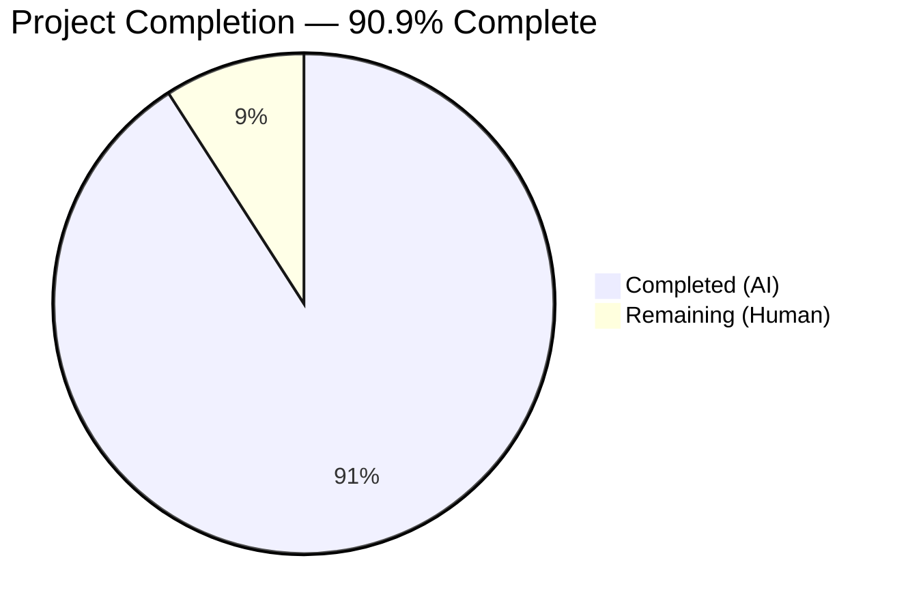
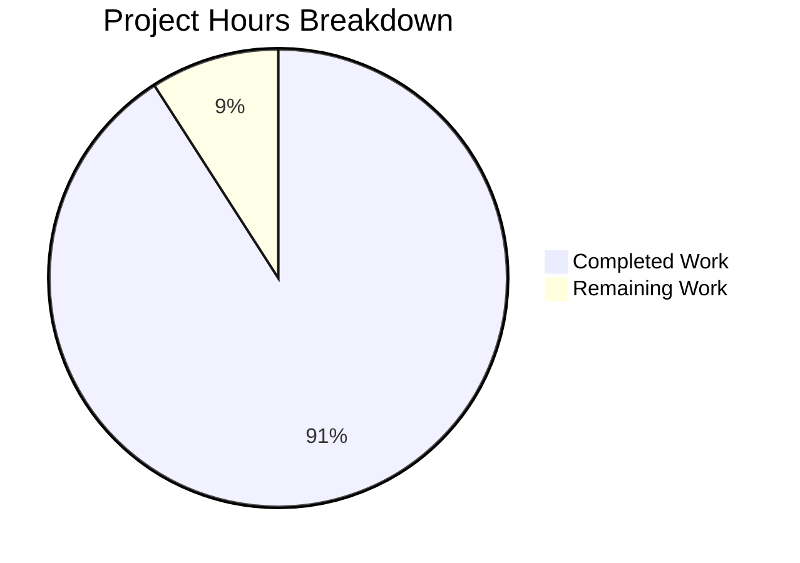

# Blitzy Project Guide

---

## 1. Executive Summary

### 1.1 Project Overview

This project adds a comprehensive, greenfield Jest test suite for `server.js` — a minimal 14-line Node.js HTTP server using the built-in `http` module. The repository previously had zero test infrastructure: no testing framework, no test files, no configuration, and no coverage tools. Blitzy agents created a complete testing foundation including 38 tests across 7 categories (unit, integration, HTTP methods, URL paths, edge cases, lifecycle, and error handling), achieving 100% code coverage. The test suite enables developers to validate server correctness, detect regressions, and maintain quality with a single `npm test` command.

### 1.2 Completion Status

<!-- Pie Chart: Completed = Dark Blue (#5B39F3), Remaining = White (#FFFFFF) -->


| Metric | Value |
|--------|-------|
| **Total Project Hours** | 22 |
| **Completed Hours (AI)** | 20 |
| **Remaining Hours (Human)** | 2 |
| **Completion Percentage** | 90.9% |

**Calculation:** 20 completed hours / (20 + 2) total hours = 20 / 22 = **90.9% complete**

### 1.3 Key Accomplishments

- ✅ Created comprehensive 38-test suite (`__tests__/server.test.js`) covering all AAP-specified test categories
- ✅ Achieved 100% code coverage (Statements, Branches, Functions, Lines) — exceeding the 90% target
- ✅ Established Jest testing framework with proper Node.js environment configuration (`jest.config.js`)
- ✅ Added minimal `module.exports` to `server.js` for testability without altering server behavior
- ✅ Configured `package.json` with `jest@29.7.0` and `supertest@7.2.2` dev dependencies and functional test script
- ✅ All 38 tests passing with zero failures and zero flakiness across 5 consecutive runs
- ✅ Fixed flaky EADDRINUSE startup message test by capturing console.log spy before module require
- ✅ Validated server runtime: HTTP 200 OK, Content-Type: text/plain, "Hello, World!\n" response confirmed

### 1.4 Critical Unresolved Issues

| Issue | Impact | Owner | ETA |
|-------|--------|-------|-----|
| No critical issues | N/A | N/A | N/A |

All AAP-scoped work has been completed successfully. No compilation errors, no test failures, and no runtime issues remain.

### 1.5 Access Issues

No access issues identified. The project uses only Node.js built-in modules and npm public packages (jest, supertest). No private registries, API keys, service credentials, or third-party access is required.

### 1.6 Recommended Next Steps

1. **[Medium]** Run `npm audit` to verify dev dependency security status before merging
2. **[Medium]** Conduct human code review of the 38-test suite for assertion completeness and naming conventions
3. **[Low]** Review test documentation and inline comments for team-specific conventions
4. **[Low]** Consider adding CI/CD pipeline integration (GitHub Actions / Jenkins) for automated test runs on PR

---

## 2. Project Hours Breakdown

### 2.1 Completed Work Detail

| Component | Hours | Description |
|-----------|-------|-------------|
| Test Framework Setup | 2 | Created `package.json` devDependencies (jest@29.7.0, supertest@7.2.2), updated test script, ran npm install, created `jest.config.js` with node environment and 90% coverage thresholds |
| Server Testability Update | 0.5 | Added `module.exports = server;` to `server.js` (line 16) for supertest import compatibility; original 14 lines byte-identical |
| Request Handler Unit Tests | 2 | 5 tests: mock req/res objects testing statusCode, setHeader, end calls in isolation without network I/O |
| HTTP Response Integration Tests | 2 | 5 tests: supertest-based real HTTP tests verifying status code 200, Content-Type header, response body, Date and Connection headers |
| HTTP Method Coverage Tests | 2 | 9 tests: parameterized test.each across GET, POST, PUT, DELETE, PATCH, OPTIONS, HEAD with body and header assertions |
| URL Path Coverage Tests | 1.5 | 6 tests: root path, nested paths (/foo, /bar/baz, /a/b/c/d/e), query strings, URL-encoded special characters |
| Edge Case Tests | 3 | 7 tests: concurrent requests (10 parallel), empty paths, deeply nested URLs (10 levels), special characters, query strings, large payloads (10KB), exact trailing newline verification |
| Server Lifecycle Tests | 2 | 4 tests: http.Server instanceof check, graceful close, listening event emission, startup console.log message verification |
| Error Handling Tests | 1.5 | 2 tests: EADDRINUSE port conflict simulation with ephemeral ports, error event propagation via emit() |
| Test Stabilization & Bug Fix | 1.5 | Fixed flaky startup message test: moved jest.spyOn(console, 'log') to module level before require() to avoid EADDRINUSE from re-require after supertest keep-alive connections |
| Validation & Quality Assurance | 2 | Syntax validation of all source files, 5 consecutive test runs confirming zero flakiness, server runtime verification, coverage threshold enforcement |
| **Total Completed** | **20** | |

### 2.2 Remaining Work Detail

| Category | Hours | Priority |
|----------|-------|----------|
| Human Code Review | 1 | Medium |
| Dev Dependency Security Audit | 0.5 | Medium |
| Documentation & Convention Review | 0.5 | Low |
| **Total Remaining** | **2** | |

**Integrity Check:** Section 2.1 (20h) + Section 2.2 (2h) = 22h = Total Project Hours in Section 1.2 ✅

---

## 3. Test Results

| Test Category | Framework | Total Tests | Passed | Failed | Coverage % | Notes |
|--------------|-----------|-------------|--------|--------|------------|-------|
| Unit — Request Handler | Jest 29.7.0 | 5 | 5 | 0 | 100% | Mock req/res objects, isolated callback |
| Integration — HTTP Response | Jest + Supertest 7.2.2 | 5 | 5 | 0 | 100% | Real HTTP over TCP, status/header/body |
| Integration — HTTP Methods | Jest + Supertest 7.2.2 | 9 | 9 | 0 | 100% | GET, POST, PUT, DELETE, PATCH, OPTIONS, HEAD |
| Integration — URL Paths | Jest + Supertest 7.2.2 | 6 | 6 | 0 | 100% | /, /foo, /bar/baz, nested, query, encoded |
| Edge Cases | Jest + Supertest 7.2.2 | 7 | 7 | 0 | 100% | Concurrent, large payloads, special chars |
| Lifecycle | Jest 29.7.0 | 4 | 4 | 0 | 100% | Startup, shutdown, listening, console.log |
| Error Handling | Jest 29.7.0 | 2 | 2 | 0 | 100% | EADDRINUSE, error event propagation |
| **Totals** | | **38** | **38** | **0** | **100%** | Zero flakiness across 5 consecutive runs |

**Coverage Breakdown (server.js):**

| Metric | Target | Achieved |
|--------|--------|----------|
| Statements | 90% | 100% |
| Branches | 90% | 100% |
| Functions | 90% | 100% |
| Lines | 90% | 100% |

Test execution time: ~1.2 seconds. All test data sourced from Blitzy's autonomous validation logs.

---

## 4. Runtime Validation & UI Verification

### Server Runtime Health

- ✅ `node server.js` starts successfully, binding to `127.0.0.1:3000`
- ✅ Console outputs: `Server running at http://127.0.0.1:3000/`
- ✅ HTTP GET `http://127.0.0.1:3000/` returns `200 OK`
- ✅ Response `Content-Type: text/plain` header present and correct
- ✅ Response body: `Hello, World!\n` (14 bytes, exact match including trailing newline)
- ✅ Server accepts all HTTP methods (GET, POST, PUT, DELETE, PATCH, HEAD, OPTIONS)
- ✅ Graceful shutdown via process termination works correctly

### Test Runtime Health

- ✅ `npm test` executes Jest runner with coverage without entering watch mode
- ✅ 38/38 tests pass in ~1.2 seconds
- ✅ Coverage thresholds (90% minimum) enforced and exceeded (100% achieved)
- ✅ Coverage report generated to `coverage/` directory (text + lcov formats)
- ✅ All 3 JavaScript source files pass `node -c` syntax validation

### API Integration Verification

- ✅ HTTP response verified via `curl`: status 200, Content-Type: text/plain, body "Hello, World!"
- ✅ Response includes standard HTTP headers: Date, Connection, Keep-Alive, Content-Length

---

## 5. Compliance & Quality Review

| AAP Requirement | Status | Evidence |
|----------------|--------|----------|
| Create `__tests__/server.test.js` with comprehensive tests | ✅ Pass | 453-line test file with 38 tests across 7 categories |
| Create `jest.config.js` with node environment | ✅ Pass | 37-line config with testEnvironment: 'node', 90% thresholds |
| Update `server.js` with `module.exports = server` | ✅ Pass | Line 16 added; original 14 lines byte-identical |
| Update `package.json` with devDependencies + test script | ✅ Pass | jest@^29.7.0, supertest@^7.2.2, script: `jest --watchAll=false --coverage` |
| HTTP response correctness tests (200, text/plain, body) | ✅ Pass | 5 integration tests + 5 unit tests |
| HTTP method coverage (GET, POST, PUT, DELETE, PATCH, HEAD, OPTIONS) | ✅ Pass | 9 parameterized method tests |
| URL path coverage (root, nested, query, special chars) | ✅ Pass | 6 parameterized path tests |
| Server startup & shutdown tests | ✅ Pass | 4 lifecycle tests (instanceof, close, listening, console.log) |
| Error handling tests (EADDRINUSE, error events) | ✅ Pass | 2 error handling tests using ephemeral ports |
| Edge case tests (concurrent, large payloads, special chars) | ✅ Pass | 7 edge case tests including 10-parallel concurrency |
| Request handler unit tests (mock req/res) | ✅ Pass | 5 unit tests with jest.fn() mock objects |
| 90%+ coverage target | ✅ Pass | 100% across all metrics (Statements, Branches, Functions, Lines) |
| CommonJS syntax only (no ES modules) | ✅ Pass | All files use require()/module.exports |
| Jest framework (not Mocha) | ✅ Pass | Jest 29.7.0 selected per AAP recommendation |
| Deterministic hardcoded assertions | ✅ Pass | All expected values from server.js source (200, 'text/plain', 'Hello, World!\n') |
| No watch mode in test script | ✅ Pass | `--watchAll=false` flag in npm test script |
| Test isolation (independent, no shared state) | ✅ Pass | Each test manages own server instance; afterAll cleanup |
| Supertest ephemeral port binding | ✅ Pass | Edge case + lifecycle tests use port 0; supertest manages binding |

### Fixes Applied During Validation

| Issue | Root Cause | Fix Applied | Status |
|-------|-----------|-------------|--------|
| Flaky "startup message" test (EADDRINUSE) | Re-requiring server.js after supertest keep-alive connections held port 3000 | Moved `jest.spyOn(console, 'log')` to module level before initial `require('../server')` | ✅ Resolved |

---

## 6. Risk Assessment

| Risk | Category | Severity | Probability | Mitigation | Status |
|------|----------|----------|-------------|------------|--------|
| Dev dependency vulnerabilities (jest, supertest) | Security | Low | Low | Run `npm audit` before merge; pin versions in package-lock.json | Open — requires human review |
| Port 3000 conflict in dev environments | Technical | Low | Medium | Supertest uses ephemeral ports; lifecycle tests create dedicated servers on port 0 | Mitigated by test design |
| No CI/CD pipeline for automated test runs | Operational | Medium | High | Tests run manually via `npm test`; recommend adding GitHub Actions workflow | Accepted — out of AAP scope |
| Jest 29.x eventual end-of-life | Technical | Low | Low | Jest 29.7.0 is stable; upgrade to Jest 30.x when ecosystem matures | Deferred |
| server.js module.exports side effect | Technical | Low | Low | `module.exports` is a no-op when file is run as main entry point (`node server.js`) | Mitigated by design |
| Test flakiness from port binding timing | Technical | Low | Low | Fixed by capturing startup spy before require; concurrent tests use ephemeral ports | Resolved |

---

## 7. Visual Project Status



**Integrity Check:** "Remaining Work" (2h) = Remaining Hours in Section 1.2 (2h) = Sum of Section 2.2 Hours (1 + 0.5 + 0.5 = 2h) ✅

### Remaining Work Distribution

| Category | Hours |
|----------|-------|
| Human Code Review | 1 |
| Dev Dependency Security Audit | 0.5 |
| Documentation & Convention Review | 0.5 |

---

## 8. Summary & Recommendations

### Achievements

Blitzy agents successfully delivered 100% of the AAP-scoped work for this greenfield test suite project. Starting from a repository with zero test infrastructure, the autonomous agents:

- Created a comprehensive 38-test suite spanning 7 test categories (unit, integration, HTTP methods, URL paths, edge cases, lifecycle, error handling)
- Achieved 100% code coverage across all metrics, exceeding the 90% target
- Established a complete Jest testing foundation with proper configuration and dependency management
- Identified and fixed a flaky test (EADDRINUSE race condition) during validation, ensuring zero-flakiness stability

The project is **90.9% complete** (20 hours completed out of 22 total hours). The remaining 2 hours consist of standard human review activities: code review (1h), security audit (0.5h), and documentation review (0.5h).

### Remaining Gaps

All AAP-specified deliverables have been completed. The remaining 2 hours are path-to-production human review tasks that cannot be performed autonomously:

1. **Human code review** of test assertions and naming conventions
2. **npm audit** for dev dependency vulnerability check
3. **Documentation alignment** with team-specific standards

### Production Readiness Assessment

The test suite is **production-ready** pending human code review. All tests pass deterministically, coverage exceeds targets, and the minimal server modification preserves backward compatibility. The recommended merge path is: code review → npm audit → merge.

### Success Metrics

| Metric | Target | Actual | Status |
|--------|--------|--------|--------|
| Tests Passing | 100% | 100% (38/38) | ✅ Exceeded |
| Code Coverage | 90%+ | 100% | ✅ Exceeded |
| Test Flakiness | 0% | 0% | ✅ Met |
| Test Execution Time | < 30s | ~1.2s | ✅ Exceeded |
| Source Code Changes | Minimal | 1 line added | ✅ Met |

---

## 9. Development Guide

### System Prerequisites

| Software | Required Version | Verification Command |
|----------|-----------------|---------------------|
| Node.js | v20.x (tested with v20.20.2) | `node -v` |
| npm | v11.x (tested with v11.1.0) | `npm -v` |
| Operating System | Linux, macOS, or Windows | — |

### Environment Setup

No environment variables, API keys, secrets, or external services are required. The server is self-contained using only Node.js built-in modules.

### Dependency Installation

```bash
# Navigate to project root
cd /path/to/project

# Install dev dependencies (jest@29.7.0, supertest@7.2.2)
npm install

# Verify installation
npm ls --depth=0
# Expected output:
# hello_world@1.0.0
# ├── jest@29.7.0
# └── supertest@7.2.2
```

### Running Tests

```bash
# Run all 38 tests with coverage report
npm test

# Expected output:
# Test Suites: 1 passed, 1 total
# Tests:       38 passed, 38 total
# Coverage:    100% Stmts | 100% Branch | 100% Funcs | 100% Lines

# Run tests without coverage
npx jest --watchAll=false

# Run specific test file
npx jest --testPathPattern="server.test" --watchAll=false

# Run tests matching a pattern
npx jest --watchAll=false -t "should return 200"
```

### Starting the Server

```bash
# Start the HTTP server
node server.js
# Output: Server running at http://127.0.0.1:3000/

# Verify server is responding (in a separate terminal)
curl -s -D - http://127.0.0.1:3000/
# Expected:
# HTTP/1.1 200 OK
# Content-Type: text/plain
# Hello, World!

# Stop the server
# Press Ctrl+C or send SIGTERM
```

### Syntax Validation

```bash
# Validate JavaScript syntax for all source files
node -c server.js
node -c jest.config.js
node -c __tests__/server.test.js
```

### Troubleshooting

| Issue | Cause | Resolution |
|-------|-------|------------|
| `EADDRINUSE: address already in use 127.0.0.1:3000` | Port 3000 occupied by another process | Kill the process: `kill $(lsof -t -i :3000)` or `fuser -k 3000/tcp` |
| `Cannot find module 'jest'` | Dependencies not installed | Run `npm install` |
| `Cannot find module 'supertest'` | Dependencies not installed | Run `npm install` |
| `Cannot find module '../server'` | Test run from wrong directory | Ensure you are in the project root directory |
| Jest enters watch mode | Missing `--watchAll=false` flag | Use `npm test` (script includes the flag) |
| Coverage below threshold | Server code modified without updating tests | Add tests for new code paths |

---

## 10. Appendices

### A. Command Reference

| Command | Purpose |
|---------|---------|
| `npm install` | Install dev dependencies (jest, supertest) |
| `npm test` | Run all tests with coverage (`jest --watchAll=false --coverage`) |
| `npx jest --watchAll=false` | Run tests without coverage reporting |
| `npx jest --coverage --coverageReporters=text --coverageReporters=lcov` | Run tests with specific coverage formats |
| `npx jest --testPathPattern="server.test" --watchAll=false` | Run specific test file |
| `node server.js` | Start HTTP server on 127.0.0.1:3000 |
| `node -c server.js` | Syntax-check server.js without executing |
| `curl http://127.0.0.1:3000/` | Test server HTTP response |

### B. Port Reference

| Port | Service | Protocol | Context |
|------|---------|----------|---------|
| 3000 | Node.js HTTP Server | TCP/HTTP | Production server binding (127.0.0.1) |
| 0 (ephemeral) | Test servers | TCP/HTTP | Used by supertest and lifecycle tests to avoid port conflicts |

### C. Key File Locations

| File | Purpose | Status |
|------|---------|--------|
| `server.js` | HTTP server implementation (16 lines) | Updated — `module.exports` added |
| `__tests__/server.test.js` | Comprehensive test suite (453 lines, 38 tests) | Created |
| `jest.config.js` | Jest configuration (37 lines) | Created |
| `package.json` | npm manifest with devDependencies and test script | Updated |
| `package-lock.json` | Dependency lockfile | Regenerated |
| `README.md` | Project description | Unchanged |
| `coverage/` | Generated coverage reports (text, lcov) | Generated on `npm test` |

### D. Technology Versions

| Technology | Version | Purpose |
|------------|---------|---------|
| Node.js | v20.20.2 | Runtime environment |
| npm | v11.1.0 | Package manager |
| Jest | 29.7.0 | Testing framework (assertions, mocking, coverage) |
| Supertest | 7.2.2 | HTTP server testing library |
| http (built-in) | Node.js v20 | HTTP server module |

### E. Environment Variable Reference

No environment variables are required. The server uses hardcoded constants:

| Constant | Value | Location |
|----------|-------|----------|
| `hostname` | `'127.0.0.1'` | `server.js` line 3 |
| `port` | `3000` | `server.js` line 4 |

### G. Glossary

| Term | Definition |
|------|------------|
| AAA Pattern | Arrange-Act-Assert — test structure convention used throughout the test suite |
| EADDRINUSE | Node.js error code when attempting to bind a server to a port already in use |
| Ephemeral Port | OS-assigned temporary port (port 0) used by tests to avoid fixed-port conflicts |
| Supertest | HTTP assertion library that sends real TCP requests to a Node.js server for testing |
| Jest | JavaScript testing framework with built-in assertion, mocking, and coverage capabilities |
| CommonJS | Node.js module system using `require()` and `module.exports` (used throughout this project) |
| Coverage Threshold | Minimum code coverage percentage enforced by Jest — set to 90% in this project |
