# Technical Specification

# 0. Agent Action Plan

## 0.1 Intent Clarification

### 0.1.1 Core Testing Objective

Based on the provided requirements, the Blitzy platform understands that the testing objective is to **add new comprehensive unit tests** for the existing `server.js` file — a minimal 14-line Node.js HTTP server that uses the built-in `http` module to serve a deterministic static response. The repository currently has **zero test infrastructure**: no testing framework, no test files, no test configuration, no assertion libraries, and no coverage tools.

**Request Category:** Add new tests (greenfield test suite creation)

The testing requirements, restated with enhanced clarity:

- **HTTP Response Correctness** — Verify that every HTTP request to the server receives a `200 OK` status code, a `Content-Type: text/plain` header, and the exact response body `"Hello, World!\n"`
- **Status Code Validation** — Confirm the response status code is `200` across all HTTP methods (GET, POST, PUT, DELETE, PATCH, HEAD, OPTIONS) and all URL paths (`/`, `/foo`, `/bar/baz`)
- **Header Verification** — Assert the presence and correctness of response headers including `Content-Type`, `Connection`, `Date`, and `Transfer-Encoding` or `Content-Length`
- **Server Startup and Shutdown** — Test that the server binds to `127.0.0.1:3000`, emits the correct startup log message (`Server running at http://127.0.0.1:3000/`), and can be gracefully closed
- **Error Handling** — Validate server behavior under error conditions such as port-already-in-use (`EADDRINUSE`), server error events, and connection edge cases
- **Edge Cases** — Cover boundary conditions including concurrent requests, empty paths, deeply nested URL paths, unusual HTTP methods, large request payloads, and special characters in URLs

**Implicit Testing Needs Surfaced:**

- The request handler callback function passed to `http.createServer()` must be tested in isolation as a unit (mocking `req`/`res` objects)
- The `console.log` startup message must be verified for exact content and single-emission behavior
- The server must be testable without modifying production code excessively; a minimal `module.exports` addition to `server.js` is necessary for testability with supertest
- Server lifecycle management (startup/teardown) in tests must prevent port conflicts and handle cleanup properly

### 0.1.2 Special Instructions and Constraints

- The user specified **"Jest or Mocha"** as acceptable testing frameworks — the plan recommends **Jest** as the primary framework due to its built-in mocking, assertion, and coverage capabilities, eliminating the need for additional packages (Chai, Sinon, Istanbul)
- No existing test patterns exist in the repository to follow; test conventions will be established from scratch
- The `README.md` states "Do not touch!" — however, for testability, a minimal modification to `server.js` (adding `module.exports`) is an essential prerequisite that the user's testing request implicitly authorizes
- No CI/CD pipeline exists; test execution is manual via npm scripts
- No environment variables or secrets are required for test execution

### 0.1.3 Technical Interpretation

These testing requirements translate to the following technical test implementation strategy:

- To **test HTTP responses, status codes, and headers**, we will create `__tests__/server.test.js` containing supertest-based integration tests that make real HTTP requests against the server and assert response properties
- To **test server startup and shutdown**, we will create lifecycle tests that verify server binding, console output (via `jest.spyOn`), and graceful close behavior
- To **test error handling**, we will create tests that simulate `EADDRINUSE` conditions using pre-occupied ports and validate error event emission
- To **test edge cases**, we will create parameterized test suites covering all HTTP methods, various URL paths, and boundary conditions
- To **test the request handler in isolation**, we will create pure unit tests that invoke the handler callback with mock `req`/`res` objects, verifying `statusCode`, `setHeader`, and `end` calls without network I/O

### 0.1.4 Coverage Requirements Interpretation

- **Explicit coverage targets:** None specified by the user
- **Implicit coverage expectations based on industry standards:** For a Node.js project using Jest, the industry-standard baseline is 80% line and branch coverage; given the zero-branch nature of `server.js` (a single execution path with no conditionals), achieving near-100% line coverage is both practical and expected
- **Existing coverage patterns:** None — the repository has zero test infrastructure
- **Critical path analysis:** The server has exactly one code path: receive request → set status 200 → set Content-Type header → send "Hello, World!\n". All 14 lines of `server.js` are reachable in every execution

To achieve comprehensive testing, coverage should include:
- 100% line coverage of `server.js` (all 14 lines)
- 100% function coverage (the request handler callback and the `server.listen` callback)
- 100% statement coverage
- Branch coverage is not applicable (zero conditional branches)

## 0.2 Test Discovery and Analysis

### 0.2.1 Existing Test Infrastructure Assessment

A comprehensive repository inspection was conducted across the entire file tree. The repository contains exactly four files at the root level with no subdirectories:

| File | Purpose | Test-Relevant? |
|------|---------|----------------|
| `server.js` | HTTP server implementation (14 lines) | Yes — sole target under test |
| `package.json` | npm package manifest; zero dependencies | Yes — requires test script and devDependencies |
| `package-lock.json` | Lockfile confirming zero packages | Yes — will be regenerated after dependency install |
| `README.md` | Project description ("Do not touch!") | No |

**Search Results for Existing Tests:**

- Test files matching `*test*`, `*spec*`, `test_*`, `spec_*`, `*_test.*`, `*_spec.*`: **None found**
- Test directories (`test/`, `tests/`, `__tests__/`, `spec/`): **None found**
- Test configuration files (`jest.config.*`, `pytest.ini`, `.mocharc.*`, `.nycrc`): **None found**
- Testing frameworks in dependencies: **None installed**
- Coverage tools: **None installed**
- Mock/stub libraries: **None installed**
- Test data fixtures or factories: **None present**

Repository analysis reveals a **completely greenfield testing situation** — there is zero existing test infrastructure. The npm test script in `package.json` is a default placeholder:

```json
"test": "echo \"Error: no test specified\" && exit 1"
```

This script always exits with code 1 and provides no testing functionality.

**Current Testing Infrastructure Summary:**

| Dimension | Status |
|-----------|--------|
| Testing framework | Not installed |
| Test runner configuration | Not present |
| Coverage tools | Not installed |
| Mock/stub libraries | Not installed (Jest provides built-in mocking) |
| Test data fixtures | Not present |
| CI/CD integration | Not configured |

### 0.2.2 Web Search Research Conducted

Extensive web research was conducted to validate framework recommendations and identify best practices:

- **Jest compatibility with Node.js 20:** Jest 29.7.0 and Jest 30.3.0 both fully support Node.js 20. Jest 29.x requires Node 14.15+ and has the broadest compatibility. Jest 30.x dropped support for Node 14, 16, 19, and 21 but fully supports Node 18+ including Node 20.
- **Supertest for HTTP server testing:** Supertest 7.2.2 is the latest stable version, providing a fluent API for testing Node.js HTTP servers. It can accept an `http.Server` instance directly, binding to an ephemeral port automatically — ideal for testing `server.js` without hardcoded port conflicts.
- **Best practices for Node.js HTTP server testing:** Tests should separate the server creation from the `listen()` call to enable supertest to manage port binding independently. Mock `req`/`res` objects for pure unit tests; use supertest for HTTP-level integration tests.
- **Jest `testEnvironment` for Node.js:** When testing server-side Node.js code, Jest's `testEnvironment` must be set to `"node"` (not the default `"jsdom"`) to avoid browser-specific API conflicts.
- **Port conflict avoidance in tests:** Supertest binds to ephemeral ports automatically when passed a server that is not yet listening, eliminating `EADDRINUSE` errors during parallel test execution.

## 0.3 Testing Scope Analysis

### 0.3.1 Test Target Identification

**Primary code to be tested:**

- **Module:** `server.js` at `/server.js` — requires unit tests, HTTP integration tests, lifecycle tests, error handling tests, and edge case tests
  - **Request handler callback** (lines 6–10): The anonymous function passed to `http.createServer()` that sets `res.statusCode`, calls `res.setHeader()`, and calls `res.end()`
  - **Server binding logic** (lines 12–14): The `server.listen()` call with hardcoded `port`, `hostname`, and the startup log callback
  - **Module-level constants** (lines 3–4): `hostname = '127.0.0.1'` and `port = 3000`

**Existing test file mapping:**

| Source File | Existing Test File | Test Categories Present |
|-------------|--------------------|------------------------|
| `server.js` | None | None |

**Dependencies requiring mocking:**

- **`http` module (Node.js built-in):** Must be mockable via `jest.mock()` for pure unit tests of the request handler callback. For integration tests, the real `http` module is used via supertest.
- **`console.log`:** Must be spied on via `jest.spyOn(console, 'log')` to verify the startup message content and emission count.
- **`process` (implicit):** For testing error scenarios like `EADDRINUSE`, the server's `error` event must be capturable.
- **No external services to mock** — the server makes no outbound requests.
- **No database interactions to stub** — the server is stateless.
- **No file system operations to virtualize** — the server reads no files at runtime.

### 0.3.2 Version Compatibility Research

Based on the current Node.js version **v20.20.2** (as detected in the environment), the recommended testing stack is:

| Tool | Recommended Version | Rationale |
|------|---------------------|-----------|
| **Jest** (testing framework) | `29.7.0` | Last stable release of the Jest 29.x line; battle-tested with Node 20; widely adopted; avoids potential breaking changes in the newer Jest 30.x line |
| **Supertest** (HTTP assertion library) | `7.2.2` | Latest stable release; full Node 20 support; fluent API for testing HTTP servers; auto-binds to ephemeral ports |
| **Jest built-in** (assertion library) | Bundled with Jest | `expect()` API included; no separate assertion library needed |
| **Jest built-in** (mocking library) | Bundled with Jest | `jest.fn()`, `jest.spyOn()`, `jest.mock()` included; no Sinon/nock required |
| **Jest `--coverage`** (coverage tool) | Bundled with Jest | Istanbul-based coverage built into Jest; no separate `nyc` or `c8` installation needed |

**Version Conflict Analysis:**

- No conflicts detected. Jest 29.7.0 supports Node.js 14.15+ which encompasses Node 20.20.2.
- Supertest 7.2.2 has no Node.js version constraint issues with Node 20.
- Both packages use CommonJS module format, matching the project's `require()` pattern in `server.js`.
- Jest 30.x was considered but not recommended due to its recent release (June 2025) and breaking changes including removed matcher aliases and renamed CLI options; Jest 29.7.0 provides a more stable foundation for a greenfield test suite.

## 0.4 Test Implementation Design

### 0.4.1 Test Strategy Selection

The test strategy employs a layered approach combining pure unit tests (mocked objects, no network) and HTTP-level integration tests (supertest with real TCP) to cover all user-specified test categories:

**Test types to implement:**

- **Unit tests:** Focus on the request handler callback in isolation using mock `req`/`res` objects. Verifies `statusCode` assignment, `setHeader()` calls, and `end()` output without starting the server.
- **Integration tests:** Focus on end-to-end HTTP request/response behavior using supertest. Verifies actual HTTP status codes, response headers, and response bodies over the network stack.
- **Lifecycle tests:** Focus on server startup (binding, listening event, console output) and shutdown (graceful close, resource cleanup).
- **Edge case tests:** Address boundary conditions including method-agnostic handling (all HTTP verbs), path-agnostic handling (various URL paths), special characters, and concurrent requests.
- **Error handling tests:** Verify server behavior when errors occur (port already in use, server-level error events, connection reset scenarios).

```mermaid
graph TD
    A[Test Suite: server.test.js] --> B[Unit Tests]
    A --> C[HTTP Integration Tests]
    A --> D[Lifecycle Tests]
    A --> E[Error Handling Tests]
    A --> F[Edge Case Tests]
    
    B --> B1[Request handler callback]
    B --> B2[Response status code]
    B --> B3[Response headers]
    B --> B4[Response body]
    
    C --> C1[GET / response]
    C --> C2[All HTTP methods]
    C --> C3[Various URL paths]
    C --> C4[Header validation]
    
    D --> D1[Server startup]
    D --> D2[Console log output]
    D --> D3[Graceful shutdown]
    D --> D4[Listening event]
    
    E --> E1[Port in use - EADDRINUSE]
    E --> E2[Server error events]
    
    F --> F1[Concurrent requests]
    F --> F2[Special characters in URL]
    F --> F3[Empty and deep paths]
    F --> F4[Large request payloads]
```



### 0.4.2 Test Case Blueprint

```
Component: Request Handler Callback (server.js lines 6-10)
Test Categories:
- Happy path: GET / returns 200, text/plain, "Hello, World!\n"
- Edge cases: POST, PUT, DELETE, PATCH, HEAD, OPTIONS all return identical response;
              /, /foo, /bar/baz, /a/b/c/d/e all return identical response;
              Paths with special characters (%20, query strings) return identical response
- Error cases: Malformed request handling (server does not crash)
- Performance boundaries: Concurrent simultaneous requests all receive correct responses
```

```
Component: Server Binding (server.js lines 12-14)
Test Categories:
- Happy path: Server binds to 127.0.0.1:3000 and emits listening event;
              console.log outputs "Server running at http://127.0.0.1:3000/"
- Edge cases: Startup log is emitted exactly once (not repeated)
- Error cases: Port 3000 already occupied triggers EADDRINUSE error
- Performance boundaries: Server starts within reasonable timeout
```

```
Component: Server Shutdown
Test Categories:
- Happy path: server.close() resolves cleanly; no active connections remain
- Edge cases: Close during idle state; close immediately after start
- Error cases: Double-close does not throw unhandled exception
```

### 0.4.3 Existing Test Extension Strategy

No existing tests to extend, refactor, or fix — the repository has zero test files. All tests are new creations.

### 0.4.4 Test Data and Fixtures Design

**Required test data structures:**

- **Mock request object:** A minimal mock with properties `method`, `url`, `headers` to simulate `http.IncomingMessage`. Created inline using `jest.fn()` or plain objects.
- **Mock response object:** A mock with `statusCode` property, `setHeader` method (jest.fn()), and `end` method (jest.fn()) to simulate `http.ServerResponse`. Created inline per test.

**Fixture organization strategy:** No external fixture files are needed. The server's deterministic behavior (static string constants) means all expected values can be declared inline within test files:

- Expected status code: `200`
- Expected Content-Type: `'text/plain'`
- Expected body: `'Hello, World!\n'`
- Expected startup message: `'Server running at http://127.0.0.1:3000/'`

**Mock object specifications:**

- `mockRequest`: `{ method: 'GET', url: '/' }` — customizable per test for method/path variation
- `mockResponse`: `{ statusCode: null, setHeader: jest.fn(), end: jest.fn() }` — assertions target `statusCode`, `setHeader.mock.calls`, and `end.mock.calls`

**Test database/state management:** Not applicable — the server is completely stateless. Each test manages its own server instance lifecycle via `beforeEach`/`afterEach` or per-test setup/teardown.

## 0.5 Test File Transformation Mapping

### 0.5.1 File-by-File Test Plan

| Target Test File | Transformation | Source File/Test | Purpose/Changes |
|-----------------|----------------|------------------|-----------------|
| `__tests__/server.test.js` | CREATE | `server.js` | Comprehensive unit and integration test suite covering HTTP responses, status codes, headers, server startup/shutdown, error handling, and all edge cases |
| `jest.config.js` | CREATE | N/A | Jest configuration file setting `testEnvironment: 'node'`, coverage thresholds, and test match patterns |
| `server.js` | UPDATE | `server.js` | Minimal modification: add `module.exports = server;` at end of file to enable supertest and require-based test imports |
| `package.json` | UPDATE | `package.json` | Add `devDependencies` (jest, supertest), update `test` script to `jest --watchAll=false --coverage`, add Jest configuration section |

### 0.5.2 New Test Files Detail

**`__tests__/server.test.js`** — Complete unit and integration test suite for server.js

- **Test categories:**
  - **Happy path:** Standard GET request returns 200, correct Content-Type, correct body; server starts and logs startup message
  - **HTTP method coverage:** GET, POST, PUT, DELETE, PATCH, HEAD, OPTIONS all return identical 200 response
  - **URL path coverage:** `/`, `/foo`, `/bar/baz`, `/a/b/c/d/e`, empty path, paths with query strings and special characters
  - **Error cases:** Port-in-use (EADDRINUSE) handling, server error event propagation
  - **Lifecycle:** Server startup emits listening event, console output verified, graceful shutdown completes cleanly
  - **Edge cases:** Concurrent requests, response body byte-exact match including trailing newline
- **Mock dependencies:**
  - `console.log` — spied via `jest.spyOn(console, 'log')` for startup message verification
  - `http.createServer` — optionally mocked via `jest.mock('http')` for pure unit tests of the handler callback
  - Mock `req`/`res` objects — plain JavaScript objects with `jest.fn()` methods for unit-level handler testing
- **Assertions focus:**
  - `expect(res.statusCode).toBe(200)` for status code verification
  - `expect(res.headers['content-type']).toBe('text/plain')` for header verification
  - `expect(res.text).toBe('Hello, World!\n')` for body verification via supertest
  - `expect(console.log).toHaveBeenCalledWith(...)` for startup message verification
  - `expect(mockRes.setHeader).toHaveBeenCalledWith('Content-Type', 'text/plain')` for unit-level handler verification

**`jest.config.js`** — Jest test runner configuration

- Specifies `testEnvironment: 'node'` for server-side testing
- Sets `coverageDirectory: 'coverage'`
- Configures `collectCoverageFrom: ['server.js']`
- Defines coverage thresholds: lines 90%, functions 90%, branches 90%, statements 90%
- Sets `testMatch: ['**/__tests__/**/*.test.js']`

### 0.5.3 Test Files to Modify Detail

No existing test files to modify — the repository has no test files. All test artifacts are new creations.

### 0.5.4 Source Files to Modify for Testability

**`server.js`** — Add module export for test access

- **Change:** Append `module.exports = server;` at end of file (line 15)
- **Rationale:** Without exporting the `server` object, supertest cannot receive it and bind to an ephemeral port for testing. This is the minimal change required for testability.
- **Impact:** No functional change to server behavior; the export is consumed only by test files via `require('./server')`

**`package.json`** — Add test infrastructure

- **New `devDependencies`:** `jest@^29.7.0`, `supertest@^7.2.2`
- **Updated `scripts.test`:** Change from placeholder to `jest --watchAll=false --coverage`
- **New `jest` configuration block:** Inline Jest configuration with `testEnvironment: 'node'`

### 0.5.5 Test Configuration Updates

| Config File | Update Description |
|-------------|-------------------|
| `jest.config.js` | CREATE — New file defining test environment, coverage settings, and test matching patterns |
| `package.json` | UPDATE — Add `devDependencies`, update `test` script, optionally add inline `jest` config block |
| `.gitignore` (optional) | CREATE — Add `node_modules/` and `coverage/` patterns if not already present |

### 0.5.6 Cross-File Test Dependencies

- **Shared fixtures:** None required — all test data is inline (static expected values)
- **Mock objects:** Created per-test within `__tests__/server.test.js`; no shared mock files needed
- **Test utilities:** None required — Jest built-in utilities (`jest.fn()`, `jest.spyOn()`, `jest.mock()`) are sufficient
- **Import dependency:** `__tests__/server.test.js` → imports `server.js` via `require('../server')` (requires the `module.exports` addition to `server.js`)
- **Import dependency:** `__tests__/server.test.js` → imports `supertest` via `require('supertest')` (requires `supertest` in `devDependencies`)

## 0.6 Dependency Inventory

### 0.6.1 Testing Dependencies

All testing packages required for this exercise, with exact names and verified versions:

| Registry | Package Name | Version | Purpose |
|----------|-------------|---------|---------|
| npm | `jest` | `29.7.0` | Testing framework with built-in assertion library, mocking, and coverage reporting |
| npm | `supertest` | `7.2.2` | HTTP assertion library for testing Node.js HTTP servers with a fluent API |

**Rationale for package selection:**

- **Jest 29.7.0** is selected over Jest 30.3.0 for maximum stability. Jest 29.x is the most battle-tested major version with Node.js 20 and avoids breaking changes introduced in Jest 30 (removed matcher aliases, renamed CLI options, upgraded jsdom). Jest bundles everything needed: test runner, `expect` assertions, `jest.fn()`/`jest.spyOn()` mocking, and Istanbul-based `--coverage` reporting — no additional packages required.
- **Supertest 7.2.2** is the latest stable release with full Node 20 compatibility. It provides the ability to pass an `http.Server` instance directly, auto-binding to an ephemeral port so tests avoid `EADDRINUSE` conflicts. It requires no additional configuration for CommonJS projects.

**Packages explicitly NOT needed (provided by Jest built-in):**

| Eliminated Package | Jest Built-in Equivalent |
|-------------------|-------------------------|
| `chai` / `expect.js` | `expect()` global provided by Jest |
| `sinon` | `jest.fn()`, `jest.spyOn()`, `jest.mock()` |
| `nyc` / `c8` / `istanbul` | `jest --coverage` flag |
| `mocha` | Jest test runner |
| `nock` | Not needed — no outbound HTTP calls to mock |

### 0.6.2 Import Updates

**Test files requiring import statements:**

- `__tests__/server.test.js` — New file with the following imports:
  - `const request = require('supertest');` — Supertest for HTTP-level testing
  - `const http = require('http');` — Node built-in for server lifecycle tests
  - `const server = require('../server');` — Import of the server object (after `module.exports` is added to `server.js`)

**Import transformation rules:**

- No import refactoring is needed since there are no existing test files
- The new test file uses CommonJS `require()` syntax to match the project's module system
- The `server.js` import path uses relative pathing (`../server`) from the `__tests__/` directory

## 0.7 Coverage and Quality Targets

### 0.7.1 Coverage Metrics

- **Current coverage:** 0% — no test suite exists; the npm test script is a non-functional placeholder that exits with code 1
- **Target coverage:** 90%+ across all dimensions (line, function, statement); 100% is achievable given the zero-branch architecture

**Coverage gaps to address:**

| Component | Current Coverage | Target Coverage | Focus Areas |
|-----------|-----------------|-----------------|-------------|
| `server.js` (all 14 lines) | 0% | 100% line coverage | Every line is reachable in a single execution path |
| Request handler callback (lines 6–10) | 0% | 100% function coverage | `statusCode` assignment, `setHeader`, `end` calls |
| `server.listen` callback (lines 12–14) | 0% | 100% function coverage | `console.log` invocation with startup message |
| Branch coverage | N/A | N/A | Zero conditional branches exist; branch coverage is structurally 100% |

**Per-file coverage targets:**

| File | Line | Function | Statement | Branch |
|------|------|----------|-----------|--------|
| `server.js` | ≥ 90% | ≥ 90% | ≥ 90% | ≥ 90% |

### 0.7.2 Test Quality Criteria

- **Assertion density:** Each test case should contain at least one meaningful assertion; HTTP integration tests should assert status code, headers, and body together for comprehensive validation
- **Test isolation:** Every test must be fully independent — each test starts its own server instance (or uses supertest ephemeral binding) and tears it down after completion via `afterEach` or `afterAll` hooks. No shared server state between tests.
- **Performance constraints:** The full test suite should complete within 30 seconds on a standard development machine. Individual test cases should complete within 5 seconds (Jest default timeout).
- **Maintainability standards:**
  - Tests use descriptive `describe`/`it` naming: `describe('HTTP Response')`, `it('should return 200 status code for GET /')`
  - Test data is inline with clear expected values (no magic numbers)
  - Server lifecycle management is handled in `beforeEach`/`afterEach` hooks to prevent resource leaks
  - Each `describe` block groups related test categories (response tests, lifecycle tests, error tests, edge cases)
- **Repository test conventions:** Since no existing conventions exist, the test suite establishes the following patterns:
  - Test file location: `__tests__/` directory at project root
  - Test file naming: `*.test.js` suffix
  - Test environment: `node` (not `jsdom`)
  - Test structure: AAA pattern (Arrange, Act, Assert)

## 0.8 Scope Boundaries

### 0.8.1 Exhaustively In Scope

**New test files:**
- `__tests__/server.test.js` — Complete test suite for server.js

**Test configuration files:**
- `jest.config.js` — Jest runner configuration with node environment, coverage settings, and test patterns

**Source file modifications (minimal, for testability only):**
- `server.js` — Addition of `module.exports = server;` on line 15

**Package manifest updates:**
- `package.json` — Addition of `devDependencies` block with `jest` and `supertest`; replacement of placeholder `test` script with functional Jest command

**Test categories in scope:**
- HTTP response correctness (status code 200, Content-Type header, response body)
- HTTP method-agnostic behavior (GET, POST, PUT, DELETE, PATCH, HEAD, OPTIONS)
- URL path-agnostic behavior (root path, nested paths, paths with query strings)
- Server startup verification (binding, listening event, console log message)
- Server shutdown verification (graceful close, resource cleanup)
- Error handling (EADDRINUSE, server error events)
- Edge cases (concurrent requests, special characters in URLs, empty paths, large payloads)
- Request handler unit tests (mock req/res objects, isolated callback invocation)

**Generated artifacts:**
- `coverage/` directory — Coverage reports generated by `jest --coverage`
- `node_modules/` directory — Installed devDependencies

### 0.8.2 Explicitly Out of Scope

- **Source code modifications beyond `module.exports`:** No changes to server logic, constants, request handler behavior, or server binding configuration
- **Refactoring of `server.js`:** No extraction of the handler into a separate module, no restructuring of the server architecture, no introduction of Express or other frameworks
- **Feature additions:** No new routes, middleware, request parsing, or response variations added alongside tests
- **Unrelated test files:** No tests for `package.json` schema validation, `README.md` content, or `package-lock.json` integrity (these are repository-level concerns, not unit test targets)
- **Performance testing and benchmarking:** No load testing with tools like Artillery, k6, or autocannon; the tests verify correctness, not throughput
- **Security testing:** No penetration testing, dependency scanning, or OWASP-style vulnerability assessments
- **CI/CD pipeline creation:** No GitHub Actions, Jenkins, or GitLab CI configuration; test execution remains manual
- **End-to-end testing frameworks:** No Playwright, Cypress, or Puppeteer integration
- **TypeScript migration:** No conversion of test files or source files to TypeScript
- **Docker containerization:** No Dockerfile or docker-compose configuration for test environments

## 0.9 Execution Parameters

### 0.9.1 Testing-Specific Instructions

**Test execution command:**
```bash
npm test
```
Which resolves to:
```bash
jest --watchAll=false --coverage
```

**Coverage measurement command:**
```bash
npx jest --coverage --coverageReporters=text --coverageReporters=lcov
```

**Single test execution pattern:**
```bash
npx jest --testPathPattern="server.test" --watchAll=false
```

**Debug mode execution:**
```bash
node --inspect-brk node_modules/.bin/jest --runInBand --watchAll=false
```

**Specific test patterns to follow:**

- All tests use the `describe`/`it` block structure provided by Jest
- Tests follow the Arrange-Act-Assert (AAA) pattern
- Server instances are created in `beforeEach` or `beforeAll` and closed in `afterEach` or `afterAll` to prevent port leaks
- Supertest assertions use the chainable `.expect()` API for status, headers, and body
- Console output verification uses `jest.spyOn(console, 'log')` with restoration in `afterEach`

**Environment setup requirements for tests:**

- Node.js v20.x must be available (v20.20.2 confirmed in environment)
- Port 3000 must not be permanently occupied (supertest uses ephemeral ports, but lifecycle tests may bind to 3000 temporarily)
- `npm install` must be run after `package.json` is updated with `devDependencies` to install Jest and supertest into `node_modules/`
- No environment variables required
- No secrets or API keys required
- No external services or databases required

## 0.10 Special Instructions for Testing

### 0.10.1 Testing-Specific Requirements

The following directives govern the testing implementation:

- **Minimal source code change principle:** The ONLY modification to `server.js` is the addition of `module.exports = server;` at the end of the file. No other lines in `server.js` may be altered, deleted, or reordered. The existing 14 lines of server logic must remain byte-identical.
- **Framework selection:** Use **Jest** as the testing framework (user specified "Jest or Mocha" — Jest is selected for its integrated assertion, mocking, and coverage capabilities that minimize dependency count).
- **Test environment:** All tests must run in Jest's `node` environment (not `jsdom`), as the server uses Node.js built-in `http` module APIs.
- **Test isolation:** Every test must be independent and executable in any order. No test may depend on the side effects of another test. Server instances created during tests must be closed in teardown hooks to prevent `EADDRINUSE` errors in subsequent tests.
- **Port management:** Supertest should be used with the server object directly (not a running server URL) so it automatically binds to ephemeral ports, avoiding conflicts with port 3000 or other tests.
- **No watch mode in CI:** The npm test script must include `--watchAll=false` to prevent Jest from entering interactive watch mode, ensuring non-blocking execution in CI and automated environments.
- **Coverage reporting:** Coverage must be collected automatically on every test run via the `--coverage` flag. The coverage report should include `text` (console output) and `lcov` (file-based report) formats.
- **CommonJS consistency:** All test files must use `require()` / `module.exports` syntax to match the project's existing CommonJS module system. Do not use ES module `import`/`export` syntax.
- **Deterministic assertions:** All expected values in tests are hardcoded static strings derived directly from `server.js` source code (`200`, `'text/plain'`, `'Hello, World!\n'`, `'Server running at http://127.0.0.1:3000/'`). No dynamic computation of expected values.

